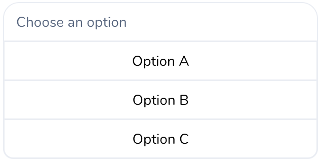

# Display Outputs

We have so far seen returning data from service actions. Service actions are also able to return display components which will be displayed directly in the chat ui to the user. There are several ui components available and we’ll take a look at building a button list component.

A button list is a list of buttons which lets the user click on any of them as a choice.

Lets build one that looks like the following in the chat ui. It lets the user choose any of the three option buttons as a part of the conversation.



```java
@ServiceAction(
    displayName = "Button List", 
    id = "buttonListServiceAction",         
    inputs = {
      @Input(name = "input", description = "First number to add")
    },
    displayOutputs =                                        // (1)
        @DisplayOutput(
            name = "buttonListDisplay",                     // (2)
            description = "Show options in a button list",  // (3)
            payloadType = PayloadType.BUTTON_LIST))         // (4)
public ServiceActionResult buttonListExample(String input) {
  // Do your necessary logic here like calling some api, computing  the data etc.
  // to build the buttons below
  
  Button optionA = Button.postbackButton("Option A", "Some payload to postback");                  // (5)
  Button optionB = Button.openUrlButton("Option B", "http://example.com");                         // (6)
  Button optionC = Button.webViewButton("Option C", "http://example.com", WebViewHeight.COMPACT);  // (7)
  
  ButtonListPayload buttonList = new ButtonListPayload("Choose an option", 
                                                       List.of(optionA, optionB, optionC));        // (8)
  MessageComponent buttonListComponent =
      MessageComponent.uiPayloadMessage(buttonList, PayloadType.BUTTON_LIST);                      // (9)
  
  Map<String, MessageComponent> displayOutputs = Map.of("buttonListDisplay", buttonListComponent); // (10)
  return ServiceActionResult.ofDisplay(displayOutputs);                                            // (11)
}
```

1. We have to declare our display output using the `displayOutputs` param of the `@ServiceAction` annotation. You may declare more than one display output.

1. Give a name for our display output to reference it later in the admin ui.

1. Give a description for the end user to understand what this display output will be rendering.

1. Declare the `PayloadType` which depends on the type of ui component we’ll be rendering. There are many ui components to choose from. We choose `BUTTON_LIST` here as an example.

1. Build our three buttons. Here we are building three buttons, each of one is different in what they can do. The first button is a postback button. On clicking this button, any value entered as the postback payload will be returned to the server and can be captured as a user’s answer. The payload is a `String` and can be in any format. So if you require an input from user to be processed later on, use this button type.

1. A simple button which opens a given url in a new browser tab.

1. WebViewButton opens the given url in a webview within the chat interface. Useful for mobile applications.

1. A button list can have an optional title. We’ll create a new button list payload by combining the title and the three buttons.

1. Create the `MessageComponent` object with our custom button list payload and payload type.

1. Define our `displayOutput` map. The key of the map should correspond to the same name we gave in step (2).

1. Return our result. In this case, we are only concerned about our display output. So we use `ServiceActionResult.ofDisplay(…)` instead of `ServiceActionResult.ofData(…)`
