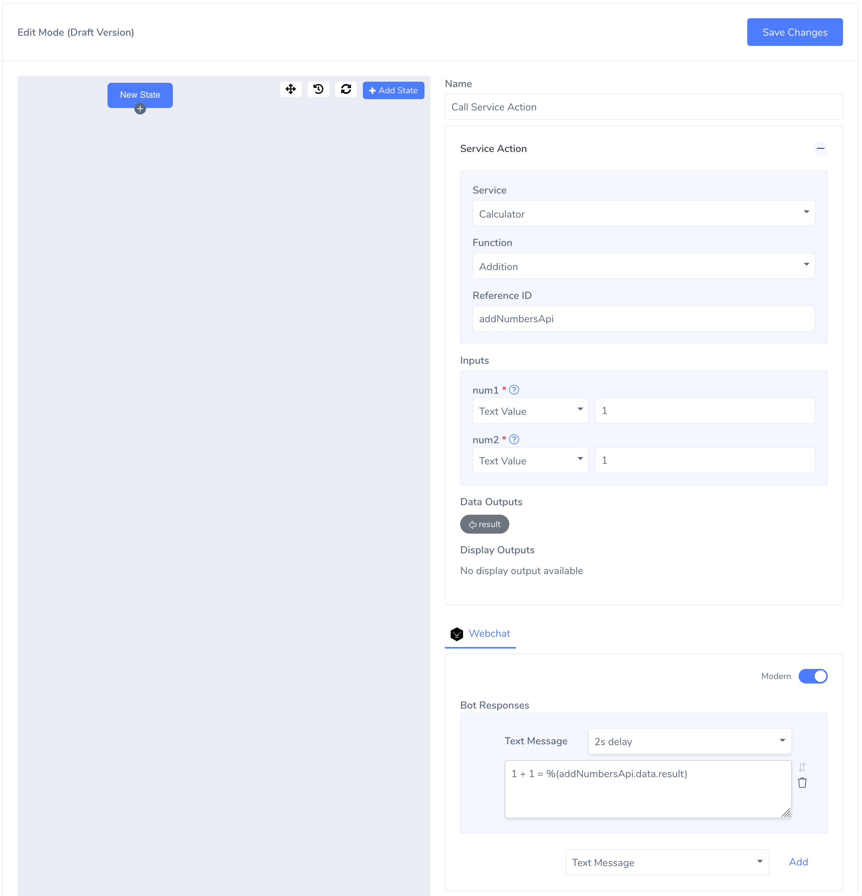

# Invoking a Service Action

- To invoke a service action, we have to configure it in the intent editor. Create a new intent with a single state and configure it like below:

Here we have defined a state to call our “Addition” service action. As we configured in the plugin, it takes the literal values `[1, 1]` as the inputs `[num1, num2]`. 
We’ll add a Reference Id (any unique string within the same intent). This helps us to reference the results of this particular service action call later.

We’ve added a Text Message component with the content `1 + 1 = %(addNumbersApi.data.result)`. Every data output can be accessed using our reference id and using dot notation using the `<reference-id>.data.<output-variable-name>` format. This will display as expected in the chat ui.
