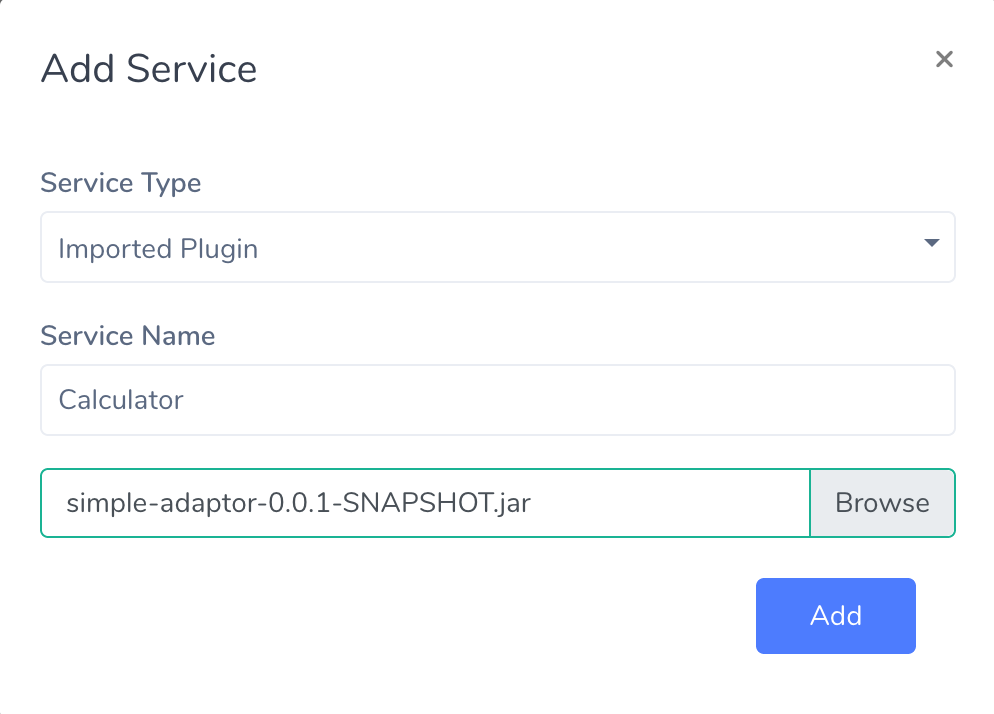
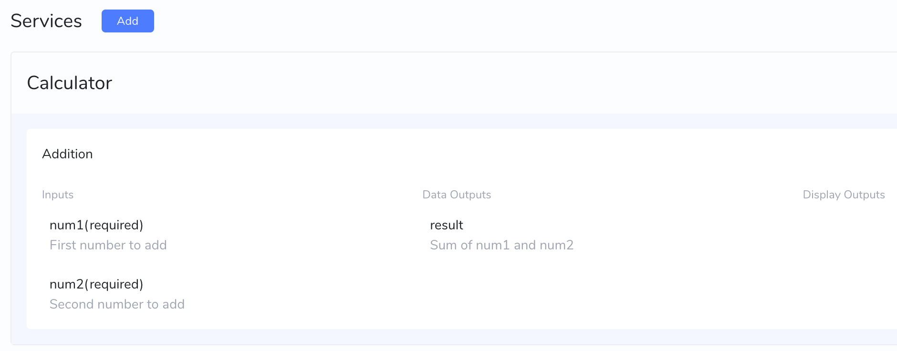
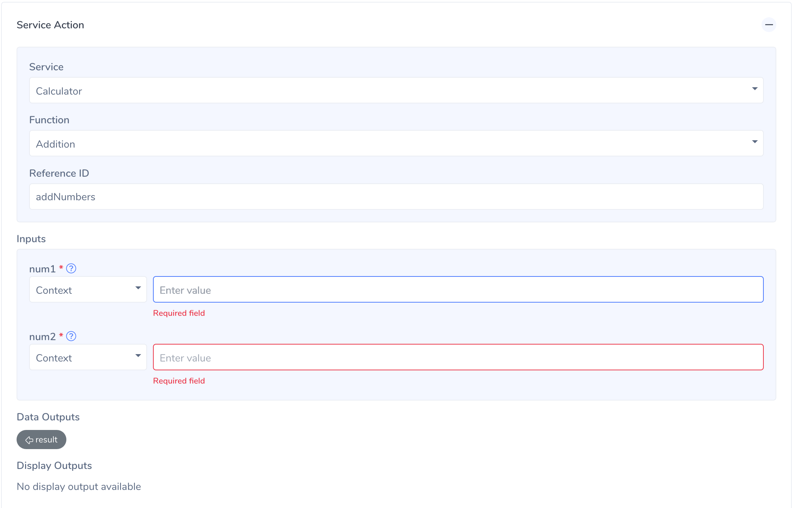

# Uploading a Plugin

In order to upload a plugin, first navigate to Converse Middleware Services page (found at <converse-installation-url>/cmw-ui/#/services)

- Click on “Services” on the left sidebar
- Click the “Add” button next to the header
- Fill in the details in the resulting modal like below

- Choose the jar file that we have previously built and Click “Add”. This should show the available functions in that jar in the resulting page like below.

- Now that we have successfully uploaded our jar, our addition service should be available in Converse Admin. To check, create a new intent in Converse Admin and open the Service Actions section like below:

