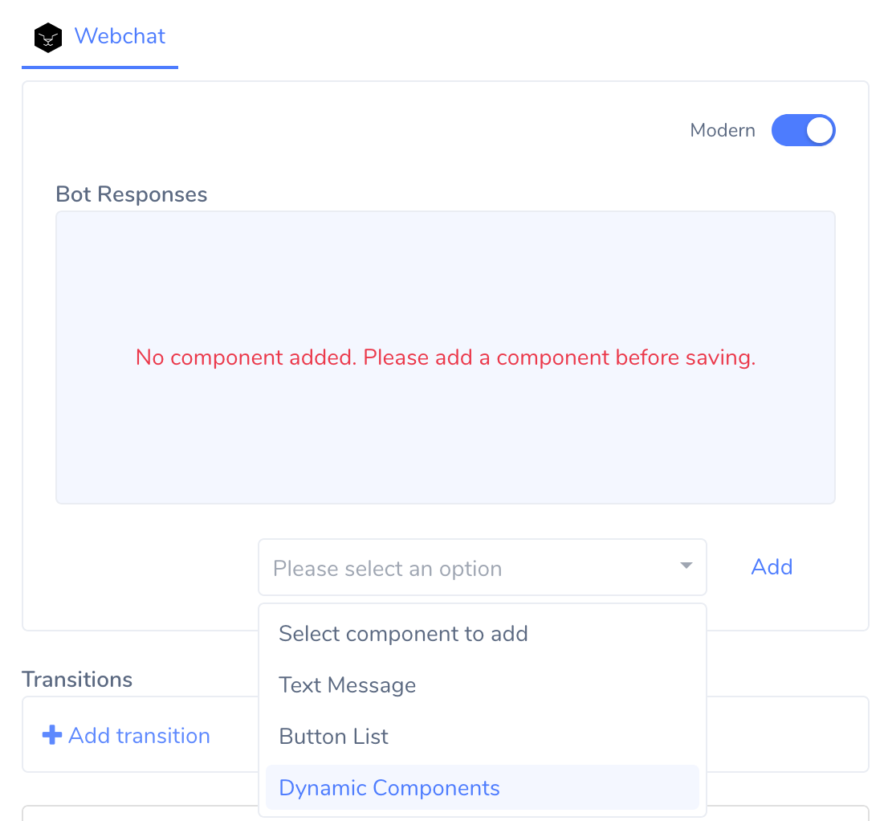
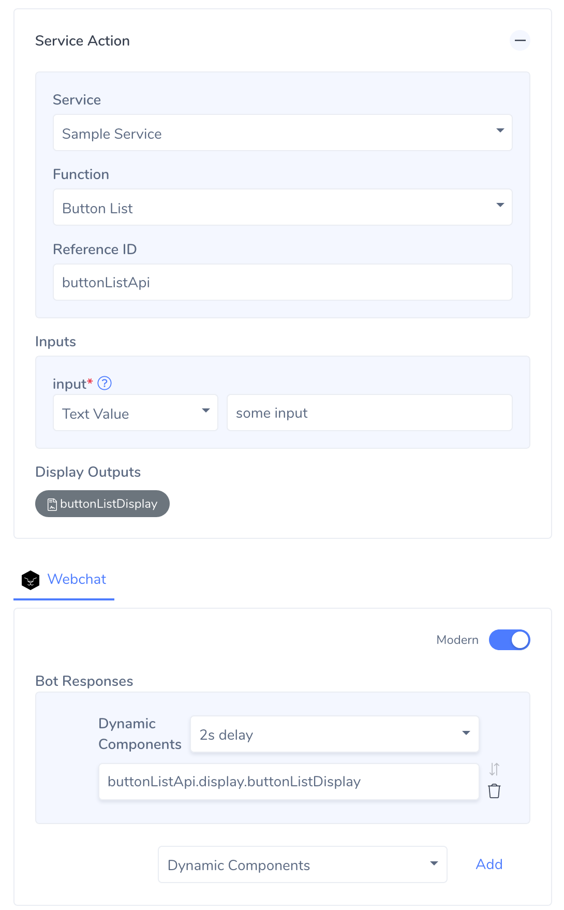

# Using Display Outputs

Once we have our display output ready, we can plug it in the intent editor using **Dynamic Components**. So far you may have built the conversational components that are readily available in the intent editor. But a service action could return dynamically generated components as seen above. To use it and display it to the end user, we will first add a new type of message component called Dynamic Component.

- Choose Dynamic Components from the components dropdown

- In the resulting text box, add the reference to the display component like below. Just like data outputs are available under `<reference-id>.data`, display outputs will be available under `<reference-id>.display` which we can use. 

